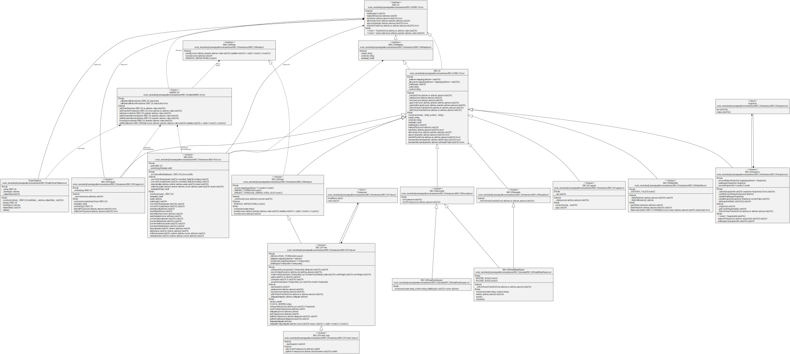
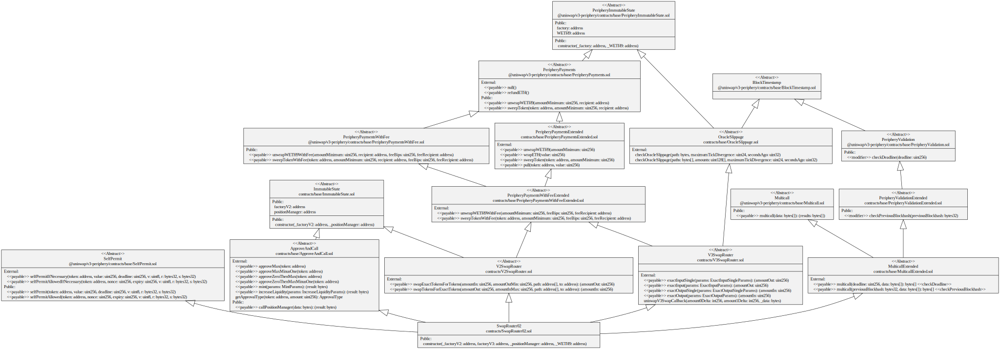
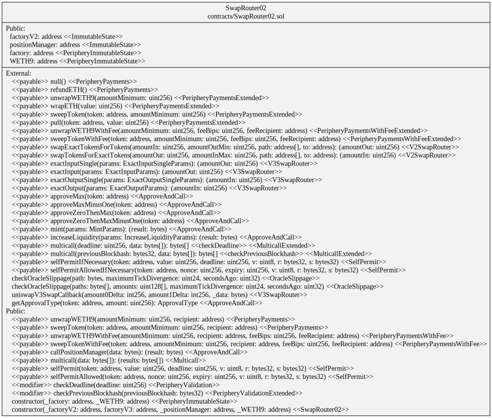
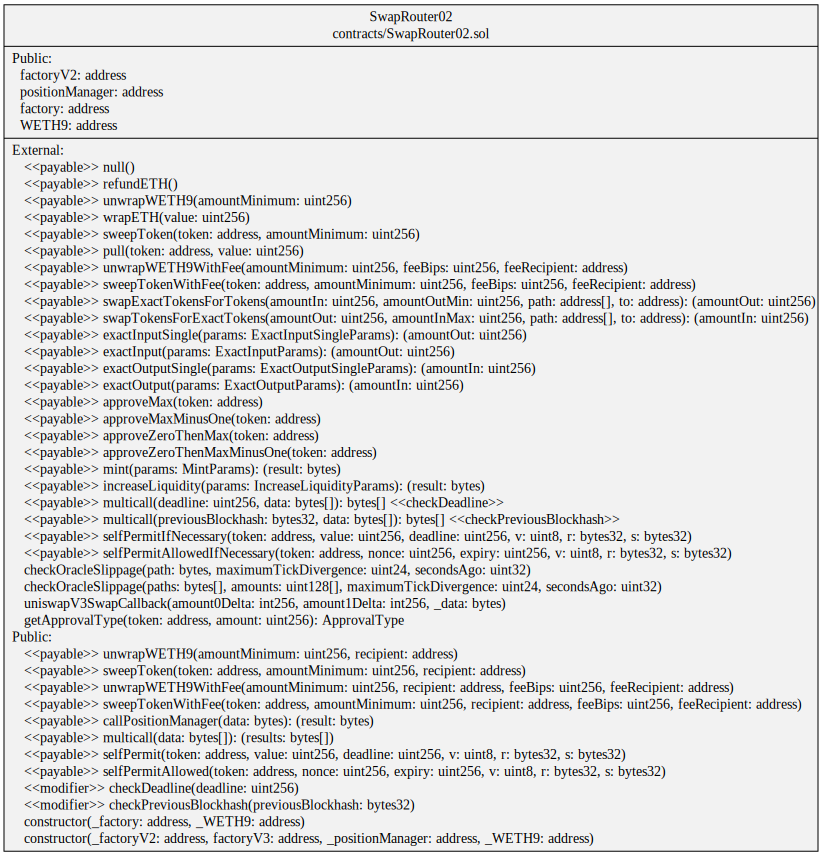
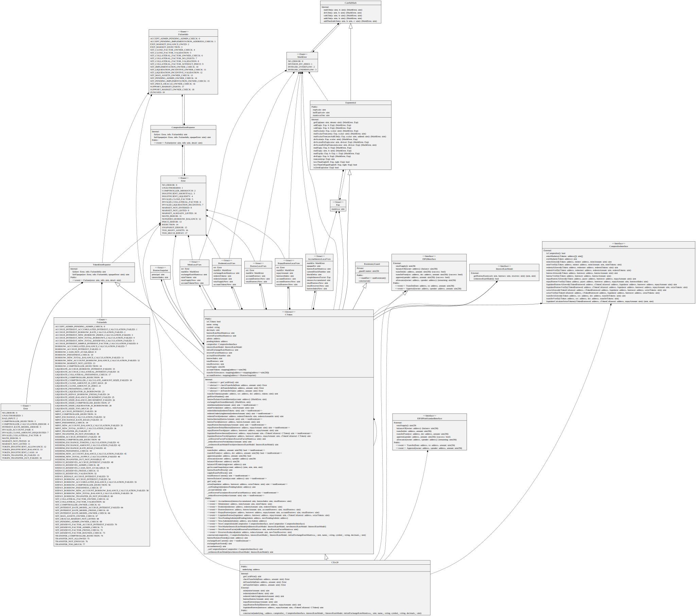
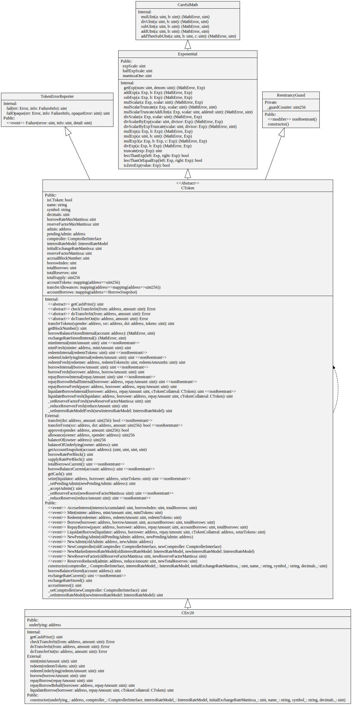

# Example UML Diagrams

See [Account Abstraction](./accountAbstraction/README.md) for example diagrams against [ERC-4337](https://eips.ethereum.org/EIPS/eip-4337) contracts.

## Bored Ape Yacht Club NFT


Generated from running

```
sol2uml 0x564ef37e0104426e829d66dc916a30376ae1239c
```

This uses the verified Solidity code loaded to Etherscan https://etherscan.io/address/0x564ef37e0104426e829d66dc916a30376ae1239c#code

## Open Zeppelin ERC20 Tokens


Generated from version [4.7.3 contracts/token/ERC20](https://github.com/OpenZeppelin/openzeppelin-contracts/tree/v4.7.3/contracts/token/ERC20)

## mStable mUSD on Polygon


Generated from running

```
sol2uml -n polygon 0x564ef37e0104426e829d66dc916a30376ae1239c
```

## Crypto Blades on BSC


Generated from running

```
sol2uml -n bsc 0x564ef37e0104426e829d66dc916a30376ae1239c
```

## Open Zeppelin All


Generated from version [4.7.3 contracts](https://github.com/OpenZeppelin/openzeppelin-contracts/tree/v4.7.3/contracts)

## Uniswap V3 Router

-   -hp hide private and internal variables and functions
-   -hi hide interfaces
-   -hl hide libraries
-   -he hide enums


Generated from running

```
sol2uml -hp -hi -hl -hs -he 0x564ef37e0104426e829d66dc916a30376ae1239c
```

This uses the verified Solidity code loaded to Etherscan https://etherscan.io/address/0x564ef37e0104426e829d66dc916a30376ae1239c#code

## Uniswap V3 Router Squashed

Same as the previous diagram but the inherited contracts are squashed into a single class diagram with the `-s, --squash` option.

The last stereotype is the contract the variable or function is implemented in. For example, `unwrapWETH9` is implemented in the `PeripheryPaymentsWithFeeExtended` contract.



Generated from running

```
sol2uml -s -hp -hi -hl -hs -he 0x564ef37e0104426e829d66dc916a30376ae1239c
```

## Uniswap V3 Router Squashed No Source

Adding the `-hsc, --hideSourceContract` option to the previous diagram removes the stereotype with the source contract the variable or function was implemented in.



Generated from running

```
sol2uml -s -hsc -hp -hi -hl -hs -he 0x564ef37e0104426e829d66dc916a30376ae1239c
```

## Tether


Generated from running

```
sol2uml 0x564ef37e0104426e829d66dc916a30376ae1239c
``

This uses the verified Solidity code loaded to Etherscan https://etherscan.io/address/0x564ef37e0104426e829d66dc916a30376ae1239c#code

## Compound Finance's cDAI


Generated from running

```
sol2uml 0x564ef37e0104426e829d66dc916a30376ae1239c
```

This uses the verified Solidity code loaded to Etherscan https://etherscan.io/address/0x564ef37e0104426e829d66dc916a30376ae1239cbb#code

## Compound Finance's cDAI Hide

Same as the previous except enums, stucts and interfaces are hidden.
Also, only classes linked to the base `CErc20` contract are included.


Generated from running

```
sol2uml -b CErc20 -he -hs -hi 
```0x564ef37e0104426e829d66dc916a30376ae1239c
