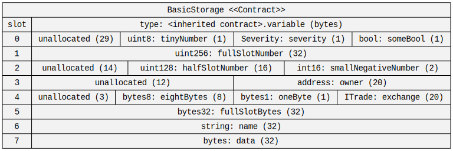
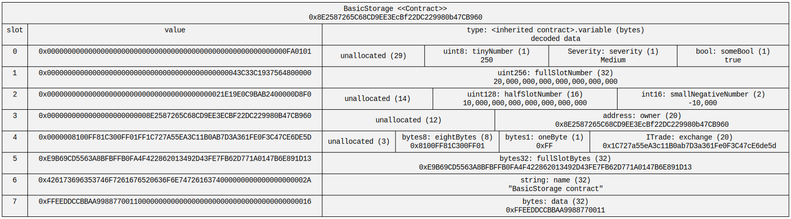
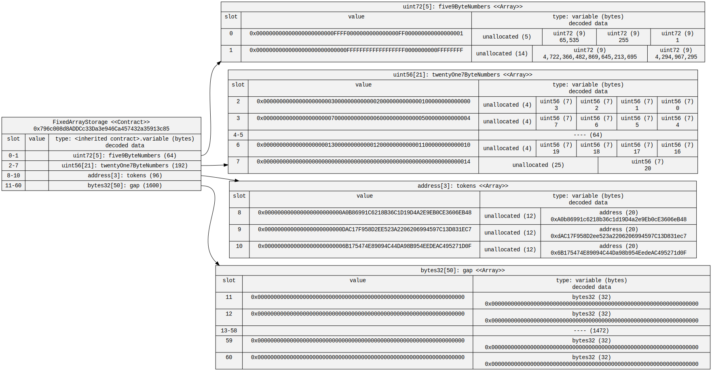
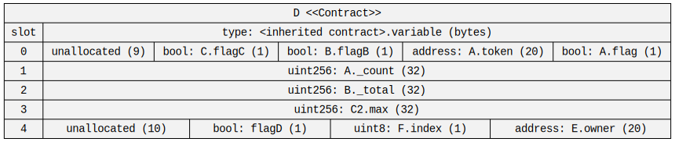
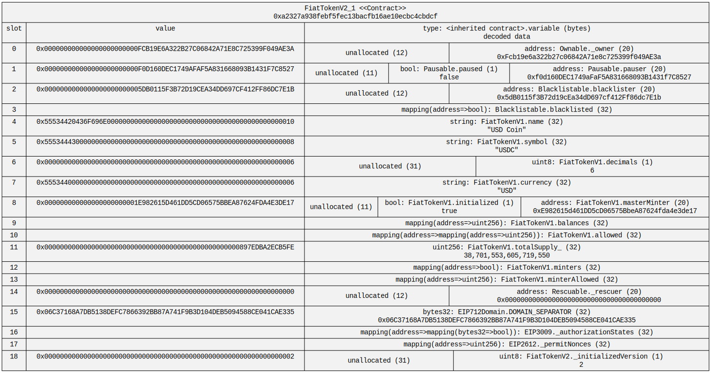
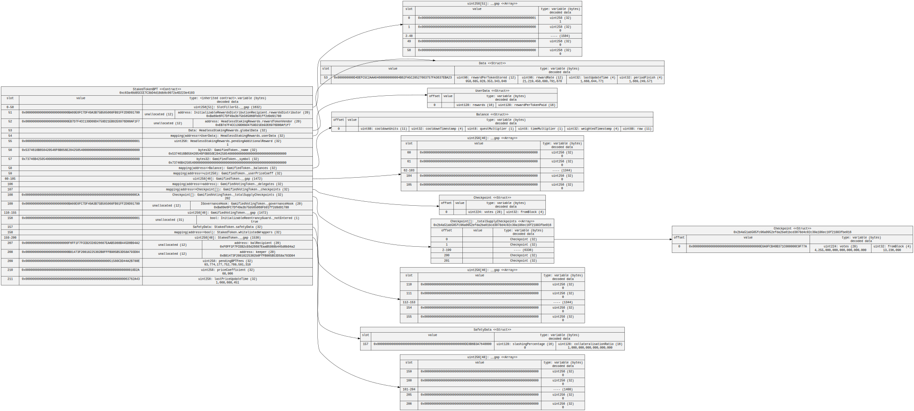

# Example Storage Diagrams

## Local Elementary Storage

The below storage diagram is a simple example from this repository [/src/contracts/BasicStorage.sol](../../src/contracts/BasicStorage.sol).

Assuming this is run from the repository's root folder, the folder of the contract source file is specified with `./src/contracts`.
The root folder `./` could also be specified as sol2uml will recursively look in all the sub folders for Solidity files.
The folder and filename could also be specified with `./src/contracts/BasicStorage.sol`.

The `-c --contract` option specifies the contract name the storage should be visualised for. In this case, it's the `BasicStorage` contract.

In this example, the `-o, --output` option just specifies the folder the diagram is saved to be saved to.
The filename will be the contract name so for the `BasicStorage` contract the filename will be `BasicStorage.svg`.
The output option can also specify the folder and file name.

```
sol2uml storage ./src/contracts -c BasicStorage -o examples/storage
```



sol2uml storage diagrams will show where each storage variable is stored in the contract's slots. For each variable, the type, name and byte size is displayed.

Solidity will pack storage variables in a single slot if the values are 16 bytes (128 bits) or less. You can see this in slots 0, 2 and 4 in the above diagram.
The variables are packed from right to left. sol2uml will mark any unused slot space as `unallocated` along with the amount of bytes.

# Elementary Storage on Arbitrum

In this example, we'll generate a storage diagram for the same [BasicStorage](../../src/contracts/BasicStorage.sol) contract deployed onto Arbitrum to [0x8E2587265C68CD9EE3EcBf22DC229980b47CB960](https://arbiscan.io/address/0x8E2587265C68CD9EE3EcBf22DC229980b47CB960#code).

The `-n, --network <network>` option is used to specify the Solidity code is to be sourced from verified files on the Arbitrum blockchain explorer [Arbiscan](https://arbiscan.io).

The `-d, --data` option is used to get the contract storage slot values from a JSON-RPC node provider like [Alchemy](https://www.alchemy.com/) or [Infura](https://www.infura.io/).
The `-u, url <url>` option can be used to specify the url of the node provider.
Alternatively, the `NODE_URL` environment variables can be used like in the following.

```
export NODE_URL=https://arb-mainnet.g.alchemy.com/v2/your-api-key
storage -n arbitrum 0x8E2587265C68CD9EE3EcBf22DC229980b47CB960 -d -o examples/storage/BasicStorageData.svg
```



When the data option is used, the value of each storage slot is displayed in hexadecimal format. sol2uml will also parse each variable value from the slot values and display in the appropriate format for the type.

Boolean typed variables will be displayed as a `true` or `false`. See `someBool` in the above as an example.

Numbers are displayed in comma separated decimals.
This includes signed negative numbers like `smallNegativeNumber` in the above that converted the two bytes `0xD8F0` to -10,000.

Addresses are formatted with mixed-case checksum encoding as per [EIP-55](https://eips.ethereum.org/EIPS/eip-55). This includes contract and interface types like `ITrade` for the `exchange` variable in the above.

The 1 byte enum values are converted from a number index to the string value of the enum. For example, the `severity` variable slot value of `0x01` is mapped to `Medium` as per the `Severity` enum with values Low, Medium and High.

Strings are converted to [UTF-8](https://en.wikipedia.org/wiki/UTF-8) and any special characters escaped so they can be processes by Graphviz. See below for examples of strings 32 bytes or larger.

## Fixed Sized Arrays

The below example was generate for the [FixedArrayStorage](../../src/contracts/FixedArrayStorage.sol) contract deployed onto Arbitrum to [0x796c008d8ADDCc33Da3e946Ca457432a35913c85](https://arbiscan.io/address/0x796c008d8ADDCc33Da3e946Ca457432a35913c85#code).

```
export NODE_URL=https://arb-mainnet.g.alchemy.com/v2/your-api-key
sol2uml storage -d -n arbitrum 0x796c008d8ADDCc33Da3e946Ca457432a35913c85 -o examples/storage/FixedArrayStorageData.svg
```



The first `five9ByteNumbers` variable is an array of five 9 byte (72 bit) numbers. As the array item is less than or equal to 16 bytes (128 bits), the array items are packed into each slot. That is, up to three array items are stored in each slot.

The second `twentyOne7ByteNumbers` variable is an array of twenty one 7 byte (56 bit) numbers.
Like the previous example, multiple array items are packed into a slot.
By default, sol2uml will just display the first two and last two slots in an array. In this case, the values for slots 4 and 5 are not fetched.

The `-a, array <number>` option can be used to override this default of two slots being displayed at the start and end of arrays. Just be careful not to set it too high as the node provider may have restrictions on the amount of slot values you can fetch.

The `tokens` array of addresses uses one slot per array item as the address type (20 bytes) is greater than 16 bytes.

Like the `twentyOne7ByteNumbers` variable, the `gap` variable will not display all 50 items in the array. sol2uml will by default just display the first two and last two slots.

## Multidimensional Fixed Arrays

This example was generate for the [MultiFixedArrayStorage](../../src/contracts/MultiFixedArrayStorage.sol) contract deployed onto Arbitrum to [0xe147cB7D90B9253844130E2C4A7Ef0ffB641C3ea](https://arbiscan.io/address/0xe147cB7D90B9253844130E2C4A7Ef0ffB641C3ea#code).

```
export NODE_URL=https://arb-mainnet.g.alchemy.com/v2/your-api-key
sol2uml storage -d -n arbitrum 0xe147cB7D90B9253844130E2C4A7Ef0ffB641C3ea -o examples/storage/MultiFixedArrayStorageData.svg
```


The first storage variable `twoByThreeNumbers` is a two by three, fixed size, multidimensional array. Note the order of the dimensions goes from right to left when being declared.

Even though the `threeByTwoBool` and `twoByThreeBool` variables only store six boolean values, they use three and two storage slots respectively.

## Dynamic Sized Arrays

Below is an example of dynamic array storage using the [/src/contracts/DynamicArrayStorage.sol](../../src/contracts/DynamicArrayStorage.sol) contract that does not fetch the slot values.

```
sol2uml storage ./src/contracts -c DynamicArrayStorage -o examples/storage
```


As sol2uml don't know from just looking at the code how many items are in each array, it will just show the location of the first storage slot and its structure.

The 32 byte string in hexidecimal format at the top of each dynamic array is the slot key. For example, the location of the values of `numbers` array starts from slot `0x290decd9548b62a8d60345a988386fc84ba6bc95484008f6362f93160ef3e563` in storage.
This is the keccak256 hash of slot 0 which has been assigned to the `numbers` array.

0x66535378de7FB9219b637DBE3e3FFad33387f80B

```
export NODE_URL=https://arb-mainnet.g.alchemy.com/v2/your-api-key
sol2uml storage -d -n arbitrum 0x66535378de7FB9219b637DBE3e3FFad33387f80B -v -o examples/storage/DynamicArrayStorageData.svg
```

## Multidimensional Dynamic Sized Arrays

## Structs

## Strings

## Mappings

## Contract Inheritance

The following example shows the storage slots with contract inheritance. This includes [diamond inheritance](https://forum.openzeppelin.com/t/solidity-diamond-inheritance/2694), imports from other files, import aliases and duplicate contract names.


```
sol2uml class -c -f png -o examples/inheritanceDiamond.png ./src/contracts/inheritance
```

The storage slots for contract `D` in [inheritance/common.sol](../../src/contracts/inheritance/common.sol).



```
sol2uml storage -c D -o examples/storage/inheritanceStorage.svg ./src/contracts/inheritance
```

## USDC

USDC storage slots from the [verified source code](https://etherscan.io/address/0xa2327a938febf5fec13bacfb16ae10ecbc4cbdcf#code) on Etherscan.

The `-d --data` option is used to get the values of the storage slots from mainnet.
As this is a proxied contract, the `-s --storage` option is used with the proxy contract address [0xA0b86991c6218b36c1d19D4a2e9Eb0cE3606eB48](https://etherscan.io/address/0xA0b86991c6218b36c1d19D4a2e9Eb0cE3606eB48).
The `-u ---url` option is used to tell which Ethereum node to get the storage values.

```
sol2uml storage 0xa2327a938febf5fec13bacfb16ae10ecbc4cbdcf -d -s 0xA0b86991c6218b36c1d19D4a2e9Eb0cE3606eB48 -u https://your-url
```



## mStable Emissions Controller

The [mStable](https://mstable.org/) Emissions Controller is deployed on mainnet to [0xBa69e6FC7Df49a3b75b565068Fb91ff2d9d91780](https://etherscan.io/address/0xBa69e6FC7Df49a3b75b565068Fb91ff2d9d91780).
This is a proxy contract so to visualise the storage layout sol2uml needs to be run against the proxy implementation [0xebfd9cD78510c591eDa8735D0F8a87414eF27A83](https://etherscan.io/address/0xebfd9cd78510c591eda8735d0f8a87414ef27a83).

By default, the output file will be saved in the current working directory using the contract name as the filename in svg format. In this case, it'll be `EmissionsController.svg`.

```
sol2uml storage 0xebfd9cD78510c591eDa8735D0F8a87414eF27A83
```


To visualise the data in the storage slots, the `-d --data` option is used.
As this is a proxied contract, the `-s --storage` option is used with the proxy contract address.
The `-u ---url` option can be used to tell which Ethereum node to get the storage values. Alternatively, the `NODE_URL` environment variable can be set.

```
export NODE_URL=https://your-node-url
sol2uml storage 0xebfd9cD78510c591eDa8735D0F8a87414eF27A83 -d -s 0xBa69e6FC7Df49a3b75b565068Fb91ff2d9d91780
```


## mStable Staking contract for MTA/ETH 80/20 Balancer Pool Token (BPT)

The `-f --format` option is used to output in svg, png or dot formats.

```
sol2uml storage 0xc63a48d85CCE7C3bD4d18db9c0972a4D223e4193 -d -s 0xeFbe22085D9f29863Cfb77EEd16d3cC0D927b011 -f svg -o examples/storage/StakedTokenBPT.svg
```



